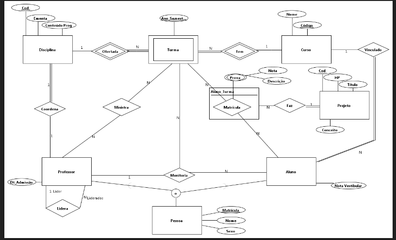
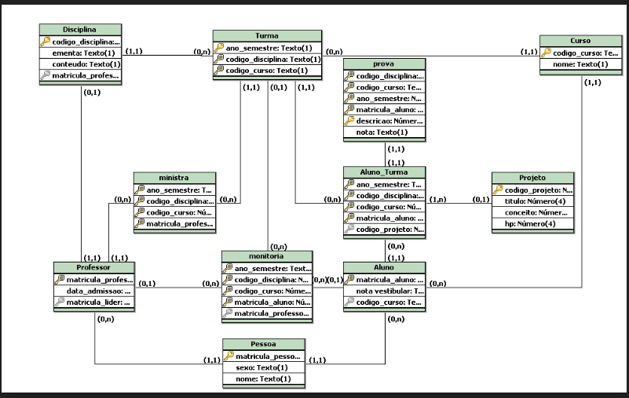

### Questões SQL
* Mostre todas as notas do período de '2016.2' do aluno de nome
'Augustus Kilter'.

```
SELECT prova.nota
    FROM Pessoa
        INNER JOIN Aluno
        ON Pessoa.matricula_pessoa = Aluno.matricula_aluno
        IINER JOIN prova
        ON Aluno.matricula_aluno = prova.matricula_aluno
    WHERE Pessoa.nome = 'Augustus Kilter' AND prova.ano_semestre = '2016.2'
    ;
```

* Para o aluno de nome 'Joao Custodia' mostre todos os projetos dos quais ele já participou, ordenando-os por período e conceito obtido.

``` 
SELECT Projeto.titulo, Projeto.conceito, Aluno_Turma.ano_semestre
    FROM Pessoa
        INNER JOIN Aluno
        ON Pessoa.matricula_pessoa = Aluno.matricula_aluno
        INNER JOIN Aluno_Turma
        ON Aluno.matricula_aluno = Aluno_Turma.matricula_aluno
        INNER JOIN Projeto
        ON Aluno_Turma.codigo_projeto = Projeto.codigo_projeto
    WHERE Pessoa.nome = 'Joao Custodia'
    ORDER BY Aluno_Turma.ano_semestre, Projeto.conceito
    ; 
```

* Liste o nome e a matrícula dos professores que ensinaram à aluna 'Helena Nunes' no seu primeiro período. Também informe o código das disciplinas cursadas.

```
SELECT Pessoa.nome, Professor.matricula_professor, Aluno_Turma.codigo_disciplina
From Pessoa
    INNER JOIN Aluno
    ON Aluno.matricula_aluno = Pessoa.matricula_pessoa
    INNER JOIN Aluno_Turma
    ON Aluno.matricula_aluno = Aluno_Turma.matricula_aluno
    INNER JOIN ministra
    ON ministra.ano_semestre = Aluno_Turma.ano_semestre
        AND ministra.codigo_disciplina = Aluno_Turma.codigo_disciplina
        AND ministra.codigo_curso = Aluno_Turma.codigo_curso
    INNER JOIN Professor
    ON ministra.matricula_professor = Professor.matricula_professor
    INNER JOIN Pessoa P2
    ON Professor.matricula_professor = P2.matricula_pessoa
    WHERE PESSOA.nome = 'Helena Nunes'
        AND Aluno_Turma.ano_semestre  = (SELECT_MIN(ano_semestre))
        FROM Aluno A2
            INNER JOIN Aluno_Turma AT2
            ON AT2.matricula_aluno = A2.matricula_aluno
        WHERE A2.matricula_aluno = A.matricula_aluno)
;
```

* Considere que todo professor é um líder em potencial. Realize
uma consulta que relacione, em duas colunas, os nomes dos
professores e o nome dos seus líderes. Mesmo os professores
que não têm líder deverão aparecer na primeira coluna e
mesmo os professores que não têm liderados devem aparecer
na lista de líderes (segunda coluna).

```
SELECT Pessoa.nome P1, Pesoa.nome P2
FROM Professor pr1
    FULL OUTER JOIN Professor pr2
    ON pr1.matricula_lider = pr2.matricula_professor
    LEFT OUTER JOIN pessoa p1
    ON p1.matricula_pessoa = pr1.matricula_professor
    LEFT OUTER JOIN pessoa p2
    ON p2.matricula_pessoa = pr2.matricula_professor
;
```
### Questões PL

* Implemente um procedimento que recebe como parâmetro de
entrada um título de um projeto e imprime os seus dados.

```
CREATE OR REPLACE PROCEDURE imprimeDados(tituloEn IN Projeto.titulo%TYPE) IS
codigo   =  Projeto.codigo_projeto%TYPE;
titulo   =  Projeto.titulo%TYPE;
conceito =  Projeto.conceito%TYPE;
hp       =  Projeto.hp%TYPE;
BEGIN
    SELECT * 
    INTO codigo, titulo, conceito, hp
    FROM Projeto
    WHERE titulo = tituloEN;

    dbms_output.put_line( 'COD: ' || v_codigo_projeto ||
                        ' - TIT: ' || v_titulo ||
                        ' - CON: ' || v_conceito ||
                        ' - HP: ' || v_hp);
END;
/
```

* 

* Crie um trigger que verifica a atualização de uma nota de
prova e não permite que ela seja negativa

```
CREATE OR REPLACE TRIGGER verifica_attNota
    BEFORE UPDATE on prova
    FOR EACH ROW
    BEGIN
        IF :NEW.nota < 0 THEN
            RAISE_APPLICATION_ERROR(-20101, 'Nota da prova não pode ser negativa);
        ENDIF;
    END;
/
```

* Criar um TRIGGER que faça um comparativo entre os ANTIGOS e
NOVOS valores logo após inserção, atualização ou deleção de um
projeto.

```
CREATE OR REPLACE TRIGGER compara_valores
    AFTER INSERT OR UPDATE OR DELETE on PROJETO
    FOR EACH ROW
    BEGIN
        dbms_output.put_line('<<Dados ANTIGOS>>');
        dbms_output.put_line('COD: '|| :OLD.codigo_projeto);
        dbms_output.put_line('TIT: '||:OLD.titulo);
        dbms_output.put_line('CON: '||:OLD.conceito);
        dbms_output.put_line('HP: '||:OLD.hp);
        dbms_output.put_line(' ');
        dbms_output.put_line('<<Dados NOVOS>>');
        dbms_output.put_line('COD: '||  :NEW.codigo_projeto);
        dbms_output.put_line('TIT: '||:NEW.titulo);
        dbms_output.put_line('CON: '||:NEW.conceito);
        dbms_output.put_line('HP: '||:NEW.hp);
    END
/
```

